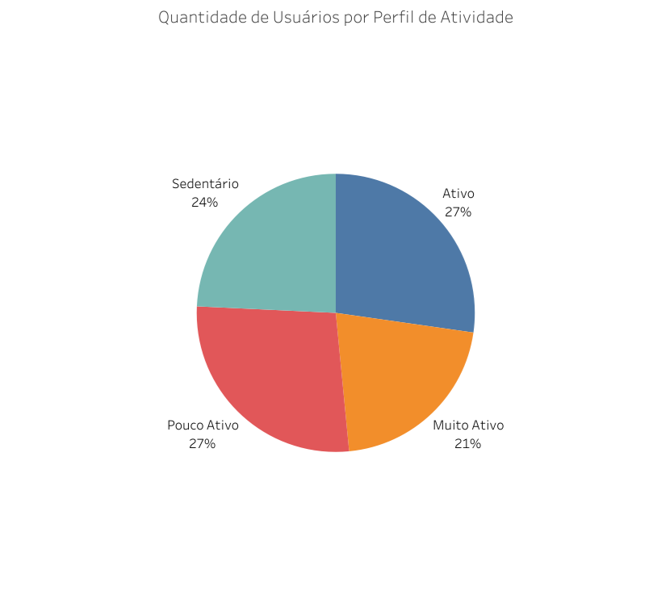

<section>
  <h1 id="estudo-de-caso--bellabeat">Estudo de Caso — Bellabeat</h1>

  

    Este projeto apresenta um estudo de caso completo de Análise de Dados, com foco em identificar padrões de comportamento
    a partir de dados de dispositivos inteligentes e transformar esses achados em recomendações práticas de negócio e marketing.
    O trabalho contempla as etapas de preparação, limpeza, análise em SQL (BigQuery) e visualização (Tableau).
  

  <h2 id="estrutura-do-projeto">Estrutura do projeto</h2>
  

    A organização de pastas abaixo foi planejada para facilitar a reprodução do estudo, separar dados brutos de dados tratados
    e manter rastreabilidade entre scripts, análises e visualizações.
  

  <pre><code>bellabeat-case-study/
├── data/
│   ├── raw/                       # Dados brutos
│   └── processed/                 # CSVs limpos exportados pelo R
│   └── sql_query/                 # CSVs de consultas realizadas em SQL
├── scripts/
│   ├── dailyActivity_cleaning.R   # Código R de limpeza e padronização para cada conjunto de dados
├── visuals/
│   ├── charts/                    # PNGs exportados do Tableau
│   └── dashboard_link.txt         # Link para o Tableau Public
├── docs/
│   ├── r_cleaning_process         # Documento do processo de limpeza com R
│   └── case_study.docx            # Documento original do estudo de caso
│    
└── README.md                      # Guia do projeto (este arquivo)
</code></pre>

  <h3 id="como-navegar">Como navegar</h3>
  <ul>
    <li><strong>Quer ver a análise direto?</strong> Vá para: <a href="#analisar">Analisar</a> e <a href="#insights-consolidados">Insights consolidados</a>.</li>
    <li><strong>Quer validar o processo técnico?</strong> Vá para: <a href="#preparar-e-processar">Preparar e Processar</a> e confira a estrutura de scripts em <a href="#estrutura-do-projeto">Estrutura do projeto</a>.</li>
    <li><strong>Quer ver recomendações finais?</strong> Vá para: <a href="#recomendacoes-de-marketing-para-a-bellabeat">Recomendações</a>.</li>
  </ul>

  

  <nav>
    <h2 id="sumario">Sumário</h2>
    <ul>
      <li><a href="#estudo-de-caso--bellabeat">Estudo de Caso — Bellabeat</a></li>
      <li>
        <a href="#perguntar">Perguntar</a>
        <ul>
          <li><a href="#contexto">Contexto</a></li>
          <li><a href="#objetivo-de-negocio">Objetivo de Negócio</a></li>
          <li><a href="#perguntas-chave">Perguntas-chave</a></li>
          <li><a href="#stakeholders-partes-interessadas">Stakeholders</a></li>
        </ul>
      </li>
      <li>
        <a href="#preparar-e-processar">Preparar e Processar</a>
        <ul>
          <li><a href="#coleta-e-selecao-de-dados">Coleta e seleção de dados</a></li>
          <li><a href="#ecossistema-tecnologico-e-processo-de-etl">Ecossistema tecnológico e processo de ETL</a></li>
          <li><a href="#garantia-de-integridade-e-padronizacao">Garantia de integridade e padronização</a></li>
          <li><a href="#processo-de-limpeza-do-conjunto-weightloginfomergedcsv">Limpeza — weightLogInfo</a></li>
        </ul>
      </li>
      <li>
        <a href="#analisar">Analisar</a>
        <ul>
          <li><a href="#segmentacao-de-usuarias-por-perfil-de-atividade">Segmentação por perfil de atividade</a></li>
          <li><a href="#horarios-com-maiores-tendencias-de-atividade">Horários com maior atividade</a></li>
          <li><a href="#relacao-entre-intensidade-de-atividade-e-eficiencia-do-sono">Intensidade vs. eficiência do sono</a></li>
          <li><a href="#pico-de-atividade-por-perfil-diario">Pico de atividade por perfil</a></li>
          <li><a href="#eficiencia-do-sono-por-tipo-de-sono">Eficiência por tipo de sono</a></li>
          <li><a href="#media-de-passos-por-faixa-de-sono">Passos por faixa de sono</a></li>
          <li><a href="#perfil-de-atividade-vs-media-de-sono">Perfil de atividade vs. média de sono</a></li>
        </ul>
      </li>
      <li><a href="#insights-consolidados">Insights consolidados</a></li>
      <li>
        <a href="#visualizacao-tableau">Visualização (Tableau)</a>
        <ul>
          <li><a href="#quantidade-de-usuarias-por-perfil-de-atividade">Usuárias por perfil</a></li>
          <li><a href="#relacao-entre-sono-e-eficiencia">Sono e eficiência</a></li>
          <li><a href="#media-de-passos-por-hora-do-dia-por-perfil">Passos por hora (por perfil)</a></li>
          <li><a href="#eficiencia-do-sono-vs-quantidade-de-sono">Eficiência vs. quantidade</a></li>
        </ul>
      </li>
      <li>
        <a href="#recomendacoes-de-marketing-para-a-bellabeat">Recomendações</a>
        <ul>
          <li><a href="#estrategia-1-otimizacao-da-recuperacao-publico-de-alta-intensidade">Estratégia 1 — Recuperação</a></li>
          <li><a href="#estrategia-2-gamificacao-e-vitalidade-publico-sedentario">Estratégia 2 — Gamificação</a></li>
        </ul>
      </li>
    </ul>
  </nav>

  

  <h2>Perguntar</h2>

  <h3>Contexto</h3>
  

    A Bellabeat é uma empresa de alta tecnologia especializada em produtos de saúde desenvolvidos especificamente para mulheres.
    Embora a marca já tenha estabelecido uma presença global sólida, existe uma oportunidade estratégica de impulsionar o crescimento
    por meio da análise de dados de uso de dispositivos inteligentes.
  

  <h3 id="objetivo-de-negocio">Objetivo de Negócio</h3>
  

    O objetivo deste estudo de caso é analisar dados de atividade física de consumidores para identificar tendências de comportamento e saúde.
    Esses insights irão apoiar uma nova estratégia de marketing, com foco em otimizar o engajamento das usuárias e identificar novos nichos de
    oportunidade para os produtos globais da Bellabeat.
  

  <h3>Perguntas-chave</h3>
  <ul>
    <li>Quais tendências podem ser identificadas no uso de dispositivos inteligentes?</li>
    <li>Como essas tendências se aplicam às clientes da Bellabeat?</li>
    <li>De que maneira essas tendências podem orientar a estratégia de marketing da empresa?</li>
  </ul>

  <h3>Stakeholders (Partes interessadas)</h3>
  <ul>
    <li><strong>Urška Sršen</strong>: cofundadora e Chief Creative Officer (CCO).</li>
    <li><strong>Sando Mur</strong>: cofundador e membro-chave da equipe executiva.</li>
    <li><strong>Equipe de Análise de Marketing</strong> da Bellabeat.</li>
  </ul>

  

  <h2>Preparar e Processar</h2>

  <h3 id="coleta-e-selecao-de-dados">Coleta e seleção de dados</h3>
  

    Utilizei o conjunto de dados público <strong>FitBit Fitness Tracker Data</strong> (Kaggle), que contém dados de monitoramento pessoal de 30 usuários.
    Devido à natureza do problema de negócio, selecionei estrategicamente quatro conjuntos de dados para compor a análise:
  

  <ul>
    <li><strong>dailyActivity_merged.csv</strong>: visão consolidada de passos, distância e calorias.</li>
    <li><strong>hourlySteps_merged.csv</strong>: padrões de atividade por horário.</li>
    <li><strong>sleepDay_merged.csv</strong>: registros de duração e sessões de sono.</li>
    <li><strong>weightLogInfo_merged.csv</strong>: monitoramento de peso e IMC.</li>
  </ul>

  <h3 id="ecossistema-tecnologico-e-processo-de-etl">Ecossistema tecnológico e processo de ETL</h3>
  

    Para garantir eficiência no processamento e permitir o cruzamento de grandes volumes de dados, estruturei o fluxo de trabalho utilizando:
  

  <ul>
    <li>
      <strong>R (RStudio)</strong>: usado na etapa de limpeza e transformação. Identifiquei inconsistências nos formatos de data
      (MM/DD/AAAA HH:MM:SS) que impediam a ingestão direta no banco de dados. Utilizei o pacote <em>tidyverse</em> para normalizar datas
      para o padrão ISO (AAAA-MM-DD), tratar valores nulos e remover duplicatas.
    </li>
    <li>
      <strong>SQL (BigQuery)</strong>: usado para análise exploratória. Com os dados limpos, realizei consultas com agregações e <em>joins</em>
      entre tabelas para identificar correlações entre atividade física e sono.
    </li>
  </ul>

  <h3 id="garantia-de-integridade-e-padronizacao">Garantia de integridade e padronização</h3>
  
Toda a documentação da limpeza foi centralizada em arquivos <code>.Rmd</code>. O processo de tratamento incluiu:

  <ul>
    <li><strong>Padronização de nomenclatura</strong>: conversão de colunas para <em>snake_case</em> (ex.: <code>TotalSteps</code> → <code>total_steps</code>) visando compatibilidade com SQL.</li>
    <li><strong>Verificação de unicidade</strong>: remoção de registros duplicados (identificados criticamente no dataset de sono).</li>
    <li><strong>Validação de limites</strong>: checagem de valores extremos para garantir que o tempo monitorado não excedesse 1.440 minutos (24h) por dia.</li>
  </ul>

  <h3 id="processo-de-limpeza-do-conjunto-weightloginfomergedcsv">Processo de limpeza do conjunto <code>weightLogInfo_merged.csv</code></h3>
  
<em>Observação: o conteúdo abaixo foi originalmente estruturado em RMarkdown (Rmd) e foi convertido para HTML mantendo a lógica e o fluxo.</em>

  <h4>Transformação e validação dos dados</h4>
  

    Antes de realizar o upload do conjunto de dados no BigQuery, foi feita a transformação e validação para evitar erros como:
    formato de data incompatível, duplicidades, inconsistências de digitação e valores nulos.
  

  <h4>Importação de pacotes e bibliotecas</h4>
  
Foram utilizados <code>tidyverse</code>, <code>lubridate</code> e <code>janitor</code> para o processamento e transformação.

  <pre><code class="language-r">library(tidyverse)
library(lubridate)
library(janitor)</code></pre>

  <h4>Importação dos dados CSV</h4>
  <pre><code class="language-r">weightLogInfo &lt;- read_csv("weightLogInfo_merged.csv")</code></pre>

  <h4>Validação da estrutura dos dados</h4>
  
Com a função <code>str()</code>, validei a estrutura dos dados e se cada coluna estava com o tipo correto.

  <pre><code class="language-r">str(weightLogInfo)</code></pre>
  
Os campos foram verificados quanto aos tipos numéricos, texto e booleano.

  <h4>Adequação do formato da data</h4>
  

    A data foi convertida para o padrão ISO, evitando erros na importação do CSV para o BigQuery. Também foi aplicada a remoção de duplicatas.
  

  <pre><code class="language-r">weightLogInfo_clean &lt;- weightLogInfo %&gt;%
  mutate(date = mdy_hms(Date)) %&gt;%
  distinct()

head(weightLogInfo_clean)</code></pre>

  <h4>Validação da conversão kg → lbs</h4>
  

    Validei a conversão de <code>WeightKg</code> para <code>WeightPounds</code> com margem de erro aceitável de 0,01, para lidar com diferenças por arredondamento.
  

  <pre><code class="language-r">df_validation &lt;- weightLogInfo_clean %&gt;%
  mutate(
    weight_calc = WeightKg * 2.20462,
    diff_check  = abs(WeightPounds - weight_calc)
  )

conversion_error &lt;- df_validation %&gt;%
  filter(diff_check &gt; 0.01)

nrow(conversion_error)</code></pre>
  

    Como não houve registros indicando erro, considerei a conversão de peso para lbs como consistente.
  

  <h4>Identificação de valores atípicos</h4>
  
Utilizei <code>max()</code> e <code>min()</code> para validar valores máximos e mínimos de peso e IMC.

  <pre><code class="language-r">df_outliers &lt;- weightLogInfo_clean %&gt;%
  summarise(
    max_weight_kg = max(WeightKg, na.rm = TRUE),
    min_weight_kg = min(WeightKg, na.rm = TRUE),
    max_bmi       = max(BMI, na.rm = TRUE),
    min_bmi       = min(BMI, na.rm = TRUE)
  )

df_outliers</code></pre>
  
Os valores ficaram dentro de faixas plausíveis e foram mantidos.

  <h4>Validação de valores na coluna booleana</h4>
  

    Para garantir consistência, validei os valores de <code>IsManualReport</code> e confirmei que havia apenas <code>TRUE</code> e <code>FALSE</code>.
  

  <pre><code class="language-r">table(weightLogInfo_clean$IsManualReport, useNA = "always")</code></pre>

  <h4>Validação do comprimento do Id e LogId</h4>
  
Validei se o comprimento dos identificadores era uniforme, reduzindo risco de inconsistências por formatação.

  <pre><code class="language-r">table(nchar(as.character(weightLogInfo_clean$Id)))
table(nchar(as.character(weightLogInfo_clean$LogId)))</code></pre>
  
Todos os valores de <code>Id</code> possuem 10 caracteres e <code>LogId</code> possui 13 caracteres, demonstrando consistência.

  <h4>Consulta de valores nulos</h4>
  
Verifiquei valores nulos por coluna para entender impacto no conjunto de dados.

  <pre><code class="language-r">colSums(is.na(weightLogInfo_clean))</code></pre>
  

    Identifiquei nulos apenas na coluna <code>Fat</code> (aprox. 97% dos registros). As colunas essenciais (<code>Id</code>, <code>LogId</code>, <code>Date</code>) permaneceram consistentes.
  

  <h4>Padronização dos nomes das colunas para snake_case</h4>
  
Utilizei o pacote <code>janitor</code> para padronizar nomes de colunas, facilitando manipulação em SQL.

  <pre><code class="language-r">weightLogInfo_clean &lt;- weightLogInfo_clean %&gt;%
  clean_names()

head(weightLogInfo_clean)</code></pre>

  <h4>Exportação do CSV limpo</h4>
  <pre><code class="language-r">write_csv(weightLogInfo_clean, "weightLogInfo_clean.csv")</code></pre>

  

    Após a limpeza e tratamento demonstrados, o upload para o BigQuery foi realizado com sucesso.
    O mesmo padrão de limpeza foi replicado para os outros três conjuntos de dados.
  

  

  <h2 id="analisar">Analisar</h2>
  

    Utilizando SQL no BigQuery, realizei uma análise exploratória para identificar tendências e gerar insights a partir dos dados disponíveis.
  

  <h3 id="segmentacao-de-usuarias-por-perfil-de-atividade">Segmentação de usuárias por perfil de atividade</h3>
  <pre><code class="language-sql">WITH user_segment AS (
  SELECT
    id,
    AVG(total_steps) AS media_passos
  FROM
    `my-first-project-479822.bellabeat_case_study.daily_activity`
  GROUP BY
    id
)
SELECT
  CASE
    WHEN media_passos &lt; 5000 THEN 'Sedentário'
    WHEN media_passos BETWEEN 5000 AND 7499 THEN 'Pouco Ativo'
    WHEN media_passos BETWEEN 7500 AND 9999 THEN 'Ativo'
    ELSE 'Muito Ativo'
  END AS categoria_usuario,
  COUNT(*) AS total_usuario,
  ROUND(AVG(media_passos), 0) AS media_passos_categoria
FROM
  user_segment
GROUP BY
  categoria_usuario
ORDER BY
  media_passos_categoria DESC;</code></pre>

  
Resultado (quantidade de usuárias por categoria):

  <table>
    <thead>
      <tr>
        <th>categoria_usuario</th>
        <th>total_usuario</th>
        <th>media_passos_categoria</th>
      </tr>
    </thead>
    <tbody>
      <tr><td>Muito Ativo</td><td>7</td><td>12488.0</td></tr>
      <tr><td>Ativo</td><td>9</td><td>8682.0</td></tr>
      <tr><td>Pouco Ativo</td><td>9</td><td>6567.0</td></tr>
      <tr><td>Sedentário</td><td>8</td><td>2936.0</td></tr>
    </tbody>
  </table>

  

    Observação: o público é bem distribuído entre perfis. Isso sugere uma estratégia de marketing segmentada:
    para usuárias ativas, iniciativas que reforcem consistência e recuperação; para usuárias sedentárias, incentivos
    que facilitem o início e manutenção de hábitos.
  

  <h3 id="horarios-com-maiores-tendencias-de-atividade">Horários com maiores tendências de atividade</h3>
  <pre><code class="language-sql">SELECT
  EXTRACT(HOUR FROM activity_hour) AS hora_do_dia,
  AVG(step_total) AS media_passos
FROM
  `my-first-project-479822.bellabeat_case_study.hourly_steps`
GROUP BY
  hora_do_dia
ORDER BY
  media_passos DESC;</code></pre>

  
Resultado (média de passos por hora do dia):

  <table>
    <thead>
      <tr>
        <th>hora_do_dia</th>
        <th>media_passos</th>
      </tr>
    </thead>
    <tbody>
      <tr><td>18</td><td>599.0</td></tr>
      <tr><td>19</td><td>583.0</td></tr>
      <tr><td>17</td><td>550.0</td></tr>
      <tr><td>12</td><td>549.0</td></tr>
      <tr><td>14</td><td>541.0</td></tr>
      <tr><td>13</td><td>538.0</td></tr>
      <tr><td>16</td><td>497.0</td></tr>
      <tr><td>10</td><td>482.0</td></tr>
      <tr><td>11</td><td>457.0</td></tr>
      <tr><td>9</td><td>433.0</td></tr>
      <tr><td>8</td><td>428.0</td></tr>
      <tr><td>15</td><td>406.0</td></tr>
      <tr><td>20</td><td>354.0</td></tr>
      <tr><td>21</td><td>308.0</td></tr>
      <tr><td>7</td><td>306.0</td></tr>
      <tr><td>22</td><td>238.0</td></tr>
      <tr><td>6</td><td>179.0</td></tr>
      <tr><td>23</td><td>122.0</td></tr>
      <tr><td>5</td><td>44.0</td></tr>
      <tr><td>0</td><td>42.0</td></tr>
      <tr><td>1</td><td>23.0</td></tr>
      <tr><td>2</td><td>17.0</td></tr>
      <tr><td>4</td><td>13.0</td></tr>
      <tr><td>3</td><td>6.0</td></tr>
    </tbody>
  </table>

  <h3 id="relacao-entre-intensidade-de-atividade-e-eficiencia-do-sono">Relação entre intensidade de atividade e eficiência do sono</h3>
  <pre><code class="language-sql">WITH resumo_atividade AS (
  SELECT
    id,
    activity_date,
    total_steps,
    very_active_minutes,
    fairly_active_minutes,
    (very_active_minutes + fairly_active_minutes) AS total_active_mins
  FROM 
    `my-first-project-479822.bellabeat_case_study.daily_activity`
),
resumo_sono AS (
  SELECT
    id,
    DATE(sleep_day) AS sleep_date,
    total_minutes_asleep,
    total_time_in_bed,
    ROUND((total_minutes_asleep / total_time_in_bed) * 100, 2) AS sleep_efficiency
  FROM
    `my-first-project-479822.bellabeat_case_study.sleep_day`
)
SELECT
  CASE
    WHEN a.total_active_mins &lt; 20 THEN '1. Baixa Intensidade (&lt; 20 min)'
    WHEN a.total_active_mins BETWEEN 20 AND 60 THEN '2. Intensidade Média (20-60 min)'
    ELSE '3. Alta Intensidade (&gt; 60 min)'
  END AS nivel_intensidade_dia,
  ROUND(AVG(s.total_minutes_asleep), 0) AS media_minutos_dormidos,
  ROUND(AVG(s.sleep_efficiency), 2) AS media_eficiencia_sono,
  COUNT(*) AS qtd_registros
FROM 
  resumo_atividade AS a
INNER JOIN resumo_sono AS s
  ON a.id = s.id
  AND a.activity_date = s.sleep_date
GROUP BY 
  1
ORDER BY 
  1;</code></pre>

  
Resultado:

  <table>
    <thead>
      <tr>
        <th>nivel_intensidade_dia</th>
        <th>media_minutos_dormidos</th>
        <th>media_eficiencia_sono</th>
        <th>qtd_registros</th>
      </tr>
    </thead>
    <tbody>
      <tr><td>1. Baixa Intensidade (&lt; 20 min)</td><td>453.0</td><td>92.85</td><td>172</td></tr>
      <tr><td>2. Intensidade Média (20-60 min)</td><td>408.0</td><td>93.0</td><td>116</td></tr>
      <tr><td>3. Alta Intensidade (&gt; 60 min)</td><td>382.0</td><td>88.66</td><td>122</td></tr>
    </tbody>
  </table>

  

    Interpretação: usuárias com alta intensidade podem manter níveis elevados de cortisol/adrenalina próximo ao horário de dormir,
    o que pode reduzir a eficiência do sono. Uma hipótese de produto/marketing é adicionar funcionalidades que monitorem estresse no
    período noturno e recomendem ações de relaxamento (ex.: respiração guiada, alongamento leve, meditação).
  

  <h3 id="pico-de-atividade-por-perfil-diario">Pico de atividade por perfil diário</h3>
  <pre><code class="language-sql">WITH perfil_diario AS (
  SELECT
    id,
    activity_date,
    CASE
      WHEN (very_active_minutes + fairly_active_minutes) &gt; 60 THEN 'Alta Intensidade'
      WHEN (very_active_minutes + fairly_active_minutes) BETWEEN 21 AND 60 THEN 'Ativo'
      ELSE 'Sedentário'
    END AS perfil_do_dia
  FROM 
    `my-first-project-479822.bellabeat_case_study.daily_activity`
),
hourly_joined AS (
  SELECT
    h.id,
    EXTRACT(HOUR FROM h.activity_hour) AS hora,
    h.step_total,
    p.perfil_do_dia
  FROM 
    `my-first-project-479822.bellabeat_case_study.hourly_steps` AS h
  INNER JOIN perfil_diario AS p
    ON h.id = p.id
    AND DATE(h.activity_hour) = p.activity_date
)
SELECT
  hora,
  ROUND(AVG(CASE WHEN perfil_do_dia = 'Alta Intensidade' THEN step_total END), 0) AS media_alta_intensidade,
  ROUND(AVG(CASE WHEN perfil_do_dia = 'Ativo' THEN step_total END), 0) AS media_ativo,
  ROUND(AVG(CASE WHEN perfil_do_dia = 'Sedentário' THEN step_total END), 0) AS media_sedentario
FROM 
  hourly_joined
GROUP BY 
  hora
ORDER BY 
  hora;</code></pre>

  

    Este resultado possibilita criar um gráfico de linhas comparando os três perfis e verificar se o perfil de alta intensidade
    concentra atividade no fim do dia (o que pode impactar a eficiência do sono). Também abre espaço para estratégias de incentivo
    aos perfis menos ativos, estimulando metas progressivas.
  

  <h3 id="eficiencia-do-sono-por-tipo-de-sono">Eficiência do sono por tipo de sono</h3>
  <pre><code class="language-sql">SELECT
  CASE
    WHEN total_sleep_records = 1 THEN 'Sono Único (Consolidado)'
    ELSE 'Múltiplos Sonos (Cochilos/Fragmentado)'
  END AS tipo_de_sono,
  COUNT(*) AS total_de_dias,
  ROUND(AVG(total_minutes_asleep), 0) AS media_minutos_totais_dormidos,
  ROUND(AVG(total_time_in_bed - total_minutes_asleep), 0) AS media_tempo_acordado_na_cama,
  ROUND(AVG(total_minutes_asleep / total_time_in_bed * 100), 2) AS eficiencia_media_percentual
FROM 
  `my-first-project-479822.bellabeat_case_study.sleep_day`
GROUP BY 
  tipo_de_sono
ORDER BY 
  eficiencia_media_percentual DESC;</code></pre>

  
Resultado:

  <table>
    <thead>
      <tr>
        <th>tipo_de_sono</th>
        <th>total_de_dias</th>
        <th>media_minutos_totais_dormidos</th>
        <th>media_tempo_acordado_na_cama</th>
        <th>eficiencia_media_percentual</th>
      </tr>
    </thead>
    <tbody>
      <tr><td>Sono Único (Consolidado)</td><td>364</td><td>413.0</td><td>38.0</td><td>91.79</td></tr>
      <tr><td>Múltiplos Sonos (Cochilos/Fragmentado)</td><td>46</td><td>466.0</td><td>46.0</td><td>90.5</td></tr>
    </tbody>
  </table>

  

    A diferença de eficiência média foi pequena (~1%), sugerindo que a fragmentação do sono, neste conjunto, não muda drasticamente a eficiência
    — embora possa impactar outros aspectos (ex.: rotina e bem-estar), que exigiriam dados adicionais para validação.
  

  <h3 id="media-de-passos-por-faixa-de-sono">Média de passos por faixa de sono</h3>
  <pre><code class="language-sql">WITH atividade_resumo AS (
  SELECT
    id,
    activity_date,
    total_steps
  FROM 
    `my-first-project-479822.bellabeat_case_study.daily_activity`
),
sono_resumo AS (
  SELECT
    id,
    DATE(sleep_day) AS sleep_date,
    total_minutes_asleep
  FROM 
    `my-first-project-479822.bellabeat_case_study.sleep_day`
)
SELECT
  CASE
    WHEN sono.total_minutes_asleep &lt; 420 THEN 'Menos de 7 horas'
    WHEN sono.total_minutes_asleep BETWEEN 420 AND 540 THEN '7 a 9 horas (Ideal)'
    ELSE 'Mais de 9 horas'
  END AS faixa_sono,
  AVG(atv.total_steps) AS media_passos
FROM 
  atividade_resumo atv
INNER JOIN sono_resumo sono
  ON atv.id = sono.id
  AND atv.activity_date = sono.sleep_date
GROUP BY 
  faixa_sono;</code></pre>

  
Resultado:

  <table>
    <thead>
      <tr>
        <th>faixa_sono</th>
        <th>media_passos</th>
      </tr>
    </thead>
    <tbody>
      <tr><td>Menos de 7 horas</td><td>9363</td></tr>
      <tr><td>7 a 9 horas (Ideal)</td><td>8177</td></tr>
      <tr><td>Mais de 9 horas</td><td>6226</td></tr>
    </tbody>
  </table>

  

    Próximo passo analítico: entender se o grupo que dorme menos tem mais passos por estar mais tempo acordado ou por praticar mais atividade de fato.
  

  <h3 id="perfil-de-atividade-vs-media-de-sono">Perfil de atividade vs. média de sono</h3>
  <pre><code class="language-sql">WITH perfil_atividade AS (
  SELECT
    id,
    activity_date,
    CASE
      WHEN (very_active_minutes + fairly_active_minutes) &gt; 60 THEN '1. Alta Intensidade'
      WHEN (very_active_minutes + fairly_active_minutes) BETWEEN 21 AND 60 THEN '2. Ativo'
      ELSE '3. Sedentário'
    END AS perfil_do_dia
  FROM 
    `my-first-project-479822.bellabeat_case_study.daily_activity`
),
resumo_sono AS (
  SELECT
    id,
    DATE(sleep_day) AS data_sono,
    total_minutes_asleep
  FROM 
    `my-first-project-479822.bellabeat_case_study.sleep_day`
)
SELECT
  a.perfil_do_dia,
  ROUND(AVG(s.total_minutes_asleep), 0) AS media_minutos_sono,
  ROUND(AVG(s.total_minutes_asleep) / 60, 1) AS media_horas_sono,
  COUNT(*) AS total_registros
FROM 
  perfil_atividade AS a
INNER JOIN resumo_sono AS s
  ON a.id = s.id
  AND a.activity_date = s.data_sono
GROUP BY 
  1
ORDER BY 
  1;</code></pre>

  
Resultado:

  <table>
    <thead>
      <tr>
        <th>perfil_do_dia</th>
        <th>media_minutos_sono</th>
        <th>media_horas_sono</th>
        <th>total_registros</th>
      </tr>
    </thead>
    <tbody>
      <tr><td>1. Alta Intensidade</td><td>382.0</td><td>6.4</td><td>122</td></tr>
      <tr><td>2. Ativo</td><td>407.0</td><td>6.8</td><td>114</td></tr>
      <tr><td>3. Sedentário</td><td>453.0</td><td>7.6</td><td>174</td></tr>
    </tbody>
  </table>

  

    Insight: o perfil mais ativo dorme menos, enquanto o perfil sedentário dorme mais. Isso sugere duas frentes:
    (1) ajudar perfis de alta intensidade a melhorar recuperação/qualidade do sono; (2) incentivar perfis sedentários com metas pequenas e consistentes,
    conectando sensação de disposição e bem-estar ao aumento gradual de movimento.
  

  

  <h2>Insights consolidados</h2>
  <ol>
    <li>
      <strong>Diversidade de perfis de usuárias</strong> 
      Os dados indicam que o uso de wearables não se limita a atletas. O ecossistema analisado abrange usuárias de alta atividade e usuárias sedentárias,
      reforçando a necessidade de comunicação segmentada.
    </li>
    <li>
      <strong>Paradoxo atividade vs. descanso</strong> 
      Observou-se uma relação inversa entre intensidade de atividade e qualidade do sono: perfis de alta intensidade tendem a dormir menos e com menor eficiência,
      enquanto perfis sedentários dormem mais e atingem com mais facilidade a janela recomendada (7–9h).
    </li>
    <li>
      <strong>Impacto do horário de treino</strong> 
      O grupo de alta intensidade concentra picos de movimento no período noturno (17h–19h), sugerindo que treinos tardios podem dificultar o relaxamento e reduzir a eficiência do sono.
    </li>
    <li>
      <strong>Quantidade de sono vs. eficiência</strong> 
      A duração total do sono não garante qualidade: a eficiência pode variar independentemente do tempo total em cama, reforçando a importância de métricas como continuidade e profundidade.
    </li>
  </ol>

  

  <h2 id="visualizacao-tableau">Visualização (Tableau)</h2>
  
<em>Observação: abaixo estão as seções de visualização. Se você tiver os links públicos do Tableau ou imagens exportadas, pode substituí-las nos placeholders.</em>

  <h3 id="quantidade-de-usuarias-por-perfil-de-atividade">Quantidade de usuárias por perfil de atividade</h3>
  

    
    Visualização para comparar a participação percentual de cada perfil, evidenciando uma distribuição relativamente equilibrada.
  

  <h3 id="relacao-entre-sono-e-eficiencia">Relação entre sono e eficiência</h3>
  

    <em>(Inserir imagem ou link do Tableau aqui)</em> 
    Visualização indicando que perfis muito ativos tendem a dormir menos e, em média, com menor eficiência.
  

  <h3 id="media-de-passos-por-hora-do-dia-por-perfil">Média de passos por hora do dia, por perfil</h3>
  

    <em>(Inserir imagem ou link do Tableau aqui)</em> 
    Visualização mostrando pico de atividade entre 17h e 19h no perfil muito ativo, próximo ao fim do dia.
  

  <h3 id="eficiencia-do-sono-vs-quantidade-de-sono">Eficiência do sono vs. quantidade de sono</h3>
  

    <em>(Inserir imagem ou link do Tableau aqui)</em> 
    Visualização reforçando baixa correlação entre tempo total de sono e eficiência, sugerindo que qualidade não é explicada apenas pela duração.
  

  

  <h2 id="recomendacoes-de-marketing-para-a-bellabeat">Recomendações de Marketing para a Bellabeat</h2>

  <h3 id="estrategia-1-otimizacao-da-recuperacao-publico-de-alta-intensidade">Estratégia 1: Otimização da recuperação (público de alta intensidade)</h3>
  

    A análise mostrou que usuárias com alta intensidade de atividade física apresentam, em média, menor quantidade de sono e menor eficiência,
    frequentemente associadas a picos de atividade no período noturno (17h–19h).
  

  

    <strong>Proposta de valor:</strong> posicionar o aplicativo Bellabeat não apenas como um monitor de performance, mas como um
    <em>Consultor Inteligente de Recuperação</em>.
  

  

    <strong>Ação de marketing:</strong> campanhas com a mensagem “o segredo da performance é o descanso”, promovendo funcionalidades que detectem
    treinos tardios e recomendem rotinas de “higiene do sono” (ex.: meditação guiada, respiração, alongamento leve) para reduzir estresse antes de dormir.
  

  <h3 id="estrategia-2-gamificacao-e-vitalidade-publico-sedentario">Estratégia 2: Gamificação e vitalidade (público sedentário)</h3>
  

    Identifiquei um grupo relevante de usuárias sedentárias que, apesar de dormirem dentro da faixa recomendada, não mantêm uma rotina de atividade física constante.
  

  

    <strong>Proposta de valor:</strong> focar na “jornada de bem-estar” (progresso gradual) em vez de metas atléticas agressivas.
  

  

    <strong>Ação de marketing:</strong> implementar mecanismos de gamificação e desafios de “pequenas vitórias” (ex.: meta de 5.000 passos),
    com mensagens que conectem movimento e benefícios imediatos (humor, disposição, qualidade do sono), aumentando engajamento e retenção.
  

</section>
